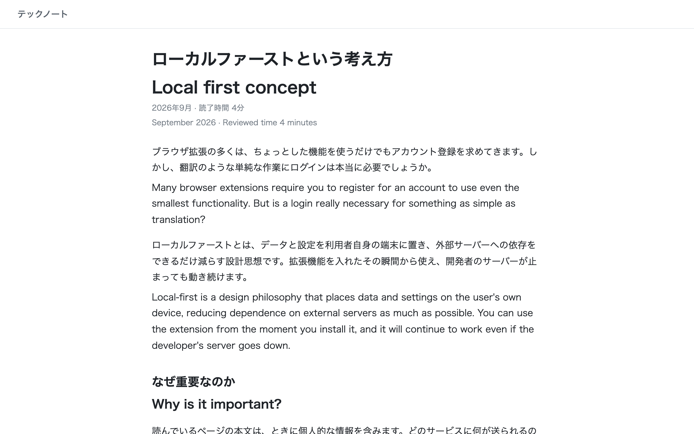
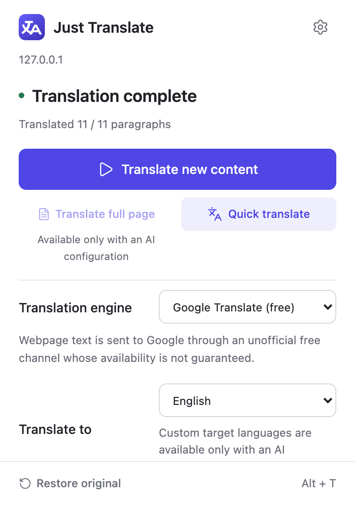
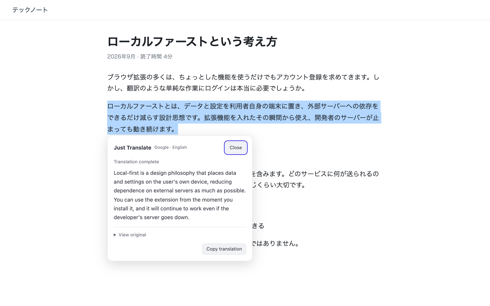
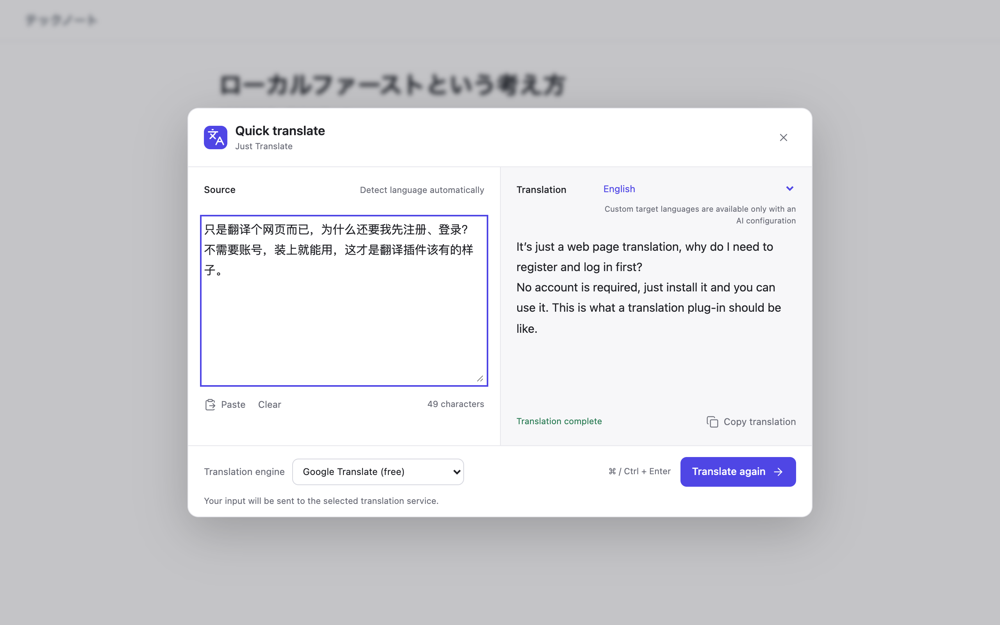
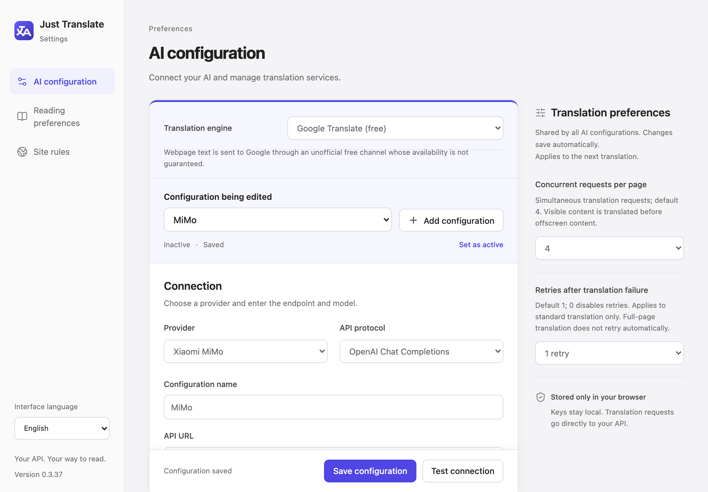

# Just Translate

**English** | [简体中文](README.zh-CN.md) | [日本語](README.ja.md) | [한국어](README.ko.md) | [العربية](README.ar.md)

A local-first bilingual web page translator for Chrome and Edge. Translations appear right under each paragraph, so you read the original and the translation side by side, or switch to translation-only.

No account, no login, no subscription. It works out of the box with the free Google or Microsoft channels, and you can bring your own OpenAI Chat Completions or Anthropic Messages API. Requests go straight from the extension to the service you picked and never pass through a developer server.



## Why

Translating a web page is a simple job, yet most bilingual translation extensions ask you to create an account and sign in before you can use them. Just Translate skips that: install it and start reading.

## Features

- **Bilingual reading**: translations render under the original paragraphs and inherit the page's typography. Toggle between "original + translation" and "translation only".
- **Free engines, no setup**: Google Translate (default) and Microsoft Translator channels need no account, API key or browser cookies.
- **Bring your own AI**: OpenAI, Anthropic, Gemini, Grok, Kimi, GLM, Xiaomi MiMo, DeepSeek, Qwen, or any compatible endpoint, including local servers on `localhost`. Each profile can have its own prompt and thinking settings.
- **Full-document translation** (AI only): sends the whole loaded article in one request, so terminology and cross-paragraph references stay consistent.
- **Selection translation**: select text, right-click, and the result appears in a popover next to the selection. Works in iframes and editable fields.
- **Quick translation**: a popup for pasted text, plus image translation with vision-capable AI models.
- **Viewport first**: what's on screen is translated first, then the next screen, then the rest. Dynamic content is picked up incrementally.
- **Site rules**: auto-translate exact domains, exclude domains or `*.example.com` wildcards.
- **Local cache**: translations are cached in IndexedDB under SHA-256 keys for 72 hours.
- **No silent fallback**: if an engine fails, your page text is never quietly resent to a different service. You retry or switch engines yourself.
- `Alt + T` shortcut, light and dark themes, UI in English, Simplified Chinese, French, German and Arabic.

## Screenshots

| Toolbar popup                                                                 | Selection translation                                                         |
| ----------------------------------------------------------------------------- | ----------------------------------------------------------------------------- |
|               |                    |
| **Quick translate**                                                           | **AI configuration**                                                          |
|  |  |

> Tip: if you use an AI engine, Xiaomi MiMo `mimo-v2.5` is a cheap and fast option for everyday reading. It's a built-in provider, so you only need to paste your API key.

## Privacy

- No developer server is involved. Requests go directly from the extension's background worker to Google, Microsoft or your configured AI endpoint.
- API keys live in `chrome.storage.local`, restricted to trusted extension contexts. Web page content scripts cannot read them.
- The cache stores no API keys and no plaintext source text.
- Code and `translate="no"` fragments inside paragraphs are replaced with local placeholders and never sent to the translation service.

The free channels use consumer web endpoints (`translate.googleapis.com` and Bing Translator), not the official Google Cloud Translation or Azure Translator APIs. They may be rate-limited, change or stop working. Don't enable translation on sensitive sites, or add them to the exclusion list.

See the full privacy policy in [PRIVACY.md](PRIVACY.md) (Chinese).

## Install

Build from source (Node.js 22.12+):

```bash
npx -y pnpm@10.34.5 install
npx -y pnpm@10.34.5 build
```

Then:

1. Open `chrome://extensions` (Chrome) or `edge://extensions` (Edge).
2. Turn on Developer mode.
3. Click "Load unpacked" and select the `dist` directory.
4. Open any HTTP/HTTPS page and click the toolbar icon, or right-click → "Translate now".

To use an AI engine, open the extension settings → AI configuration, pick a provider, and paste your API key.

## Development

```bash
npx -y pnpm@10.34.5 test
npx -y pnpm@10.34.5 check   # lint, tests, type check and build verification
```

Stack: Manifest V3, React 19, TypeScript, Vite. Detailed design notes (in Chinese) are in [docs/details.zh-CN.md](docs/details.zh-CN.md).

## License

Just Translate is licensed under the [GNU Affero General Public License v3.0](LICENSE).

You may use, modify and redistribute it under the AGPL-3.0, which requires derivative works, including those offered as a network service, to be released under the same license. If you want to use it in a closed-source or commercial product without those obligations, a separate commercial license is available. Please [open an issue](https://github.com/aikilan/just-translation/issues) to get in touch.
