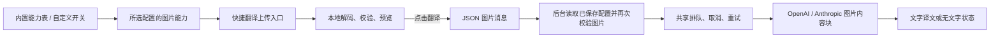

# 快捷图片翻译验收

日期：2026-09-23。范围：快捷翻译中手动上传单图，使用模型原生视觉能力输出文字译文。图片替换原文排版、网页图片自动翻译、截图、剪贴板图片和批量图片不在本次范围内。

最新状态：深度审查发现的图片 DOM 暴露与 GPT-5.6 别名误判均已修复，新增实际 `dist` 扩展验收。最终全量检查为 81 个测试文件、973 项测试通过，详情见 [审查修复记录](./fixes.md)。下文保留初始实现的验收过程。

## 实现

- `image-capabilities.ts` 是本地查询入口，每条规则保留官方来源和核对日期。完整 provider/model/protocol/endpoint 匹配，不进行运行时探测或按模型前缀猜测。
- 自定义供应商、非官方端点和未列出的模型由 `imageInputEnabled` 显式控制，默认关闭。改变身份字段会重置手动选择；修改名称、密钥、Prompt 不会重置。
- `supportsImageInput` 按每个配置对外暴露，无密钥。弹窗使用本地选中的配置，后台重新从存储解析能力，不信任界面的判断。
- 新的 `TranslationTaskService` 承接划选、快捷文字、快捷图片请求。文档归属、排队、取消共用；图片不进入段落缓存。图片请求每次获准发送后最多等待 60 秒，等待队列不计入 HTTP 超时。
- PNG/JPEG 保留原始字节，WebP 经原生 `OffscreenCanvas` 转为 PNG。原始与转换后文件均不超过 4 MiB；最长边 4096 像素、总计不超过 1600 万像素。后台再验证实际文件格式、解码结果和尺寸。
- 仅显示完整文字结果；空识别单独表示。HTTP 400 等确定性拒绝不自动重试；429 遵守 Retry-After 并更新共享队列，408、5xx 和临时失败按配置重试。服务商错误正文和流错误中的输入回显不进入界面。
- 不持久化图片、文件名和译文，不将图片内容写入日志。点击翻译才把图片发送至所选 API；关闭、停止、导航或标签关闭取消请求，晚到的结果无法覆盖新任务。
- 快捷弹窗使用扩展隔离世界中的封闭 Shadow DOM；宿主网页无法通过根节点属性和事件路径读取文件输入框或预览图片。

## 能力资料核对

下表仅对应项目内置的明确模型 ID。完整型号和协议见源码能力表；同品牌的新模型仍需要独立核对。

| 服务商 | 本次核对结论 | 官方资料 |
| --- | --- | --- |
| OpenAI | 内置 GPT 4.1/4o/5.x、GPT-6 Astra 接收图片；`gpt-5.6` 是 GPT-5.6 Sol 的官方别名，同样支持图片 | [Images and vision](https://developers.openai.com/api/docs/guides/images-vision)、[GPT-5.6 Sol 与别名](https://developers.openai.com/api/docs/models/gpt-5.6-sol) |
| Gemini | 内置 Gemini 型号使用 OpenAI 兼容接口的图片内容块 | [OpenAI compatibility](https://ai.google.dev/gemini-api/docs/openai#image-understanding) |
| Grok | Grok 4.5/4.6 支持图片；当前端点按 JPEG/PNG 发送 | [Models](https://docs.x.ai/developers/models) |
| Anthropic | 内置 Claude 型号按视觉输入处理 | [Vision](https://platform.claude.com/docs/en/build-with-claude/vision) |
| Kimi | K2.6、K2.7 Code/Highspeed、K3 支持图片；删除已下线 K2.5 的模型建议 | [Models](https://platform.kimi.ai/docs/models)、[K2.7 Code](https://platform.kimi.ai/docs/guide/kimi-k2-7-code-quickstart) |
| GLM | 项目内置的 GLM 4.5/Air、4.6、4.7、5、5.1、5.2 均标明文字输入 | [4.5](https://docs.z.ai/guides/llm/glm-4.5)、[4.6](https://docs.z.ai/guides/llm/glm-4.6)、[4.7](https://docs.z.ai/guides/llm/glm-4.7)、[5](https://docs.z.ai/guides/llm/glm-5)、[5.1](https://docs.z.ai/guides/llm/glm-5.1)、[5.2](https://docs.z.ai/guides/llm/glm-5.2) |
| MiMo | `mimo-v2.5` 支持；`mimo-v2.5-pro` 仅文字 | [图片理解](https://mimo.mi.com/docs/en-US/quick-start/usage-guide/multimodal-understanding/image-understanding)、[Pro](https://mimo.mi.com/models/en-US/mimo-v2.5-pro) |
| DeepSeek | `deepseek-flash` 支持；`deepseek-v4-pro` 不支持 | [Vision](https://api-docs.deepseek.com/guides/vision/)、[能力表](https://api-docs.deepseek.com/quick_start/pricing/) |
| Qwen | 3.5 Plus、3.6 Plus、3.7 Plus、3.8 Max/Flash 支持；其他内置文字型号关闭。`qwen3.7-max` 不等于 `qwen3.7-max-2026-06-08`，不能继承后者视觉能力 | [Vision](https://www.alibabacloud.com/help/en/model-studio/vision-model)、[Text generation](https://www.alibabacloud.com/help/en/model-studio/text-generation)、[Qwen Plus](https://help.aliyun.com/en/model-studio/qwen-plus)、[Qwen Flash](https://help.aliyun.com/en/model-studio/qwen-flash)、[Coder Next](https://huggingface.co/Qwen/Qwen3-Coder-Next) |

本表描述图片输入能力，不保证模型仍向所有账号开放，也不把未确认视为已确认不支持。

## 自动化验证

先补充失败测试，再实现能力查询、图片处理、协议请求、后台路由和界面状态。覆盖：

- 所有内置模型都有明确条目、来源和核对日期；官方完整端点归一化、代理地址、手动开关与未知模型。
- 配置保存与重开、修改模型/地址/协议重置、普通名称编辑保留选择。
- 文件大小、签名、实际解码、尺寸、伪造 MIME/尺寸、超长后台载荷、WebP 转换。
- OpenAI 和 Anthropic 图片请求、可选文字、流结果校验、空结果、HTTP 400 不重试、429 重入队列、流错误回显脱敏。
- 本地模型入口判断、关闭后解码结果失效、图片仅在提交时发送、不支持模型阻止发送、无文字结果不可复制。
- 后台以已保存配置为准；存储读取与解码期间的关闭/导航取消；实际 service-worker 消息分发及共享取消路由。
- 五种界面语言的完整消息与参数契约；已有文字、划选、全文翻译回归测试。

`pnpm check` 已通过 ESLint、全量 Vitest（81 个测试文件、968 项测试）、TypeScript、Vite 构建与扩展打包结构检查；不增加版本号。完整输出见 [check.txt](./check.txt)。

## 浏览器与 HTTP 验收

Chrome for Testing 153.0.8010.12，独立测试浏览器。通过原生文件选择器实际读取浏览器生成的 PNG/WebP 测试图片。测试页使用生产弹窗和控制器、独立 Worker 中的生产任务服务/图片校验/队列/协议客户端，通过本地真实 HTTP 返回固定 SSE。没有使用真实供应商密钥，也没有将用户图片发送至外部服务。

| 场景 | 已观察结果 |
| --- | --- |
| PNG 600×200 预览 | 正常显示；提交前本地 API 请求数为 0 |
| OpenAI 仅图片 | 请求包含图片，返回两行测试译文，复制按钮启用 |
| Anthropic 图片与文字 | 正常返回并展示测试译文 |
| 切换仅文字模型 | 上传/更换入口隐藏，缩略图保留，显示原因，提交按钮禁用 |
| WebP 600×200 | 本地成功转换；HTTP 实际收到 PNG，后台再次解码后成功返回 |
| 关闭进行中的请求 | 本地服务器观察到连接中断；重开保留草稿，不显示旧结果 |
| 空结果 | 显示「未识别到可翻译文字」，复制禁用 |
| HTTP 400 | 显示安全的 HTTP 状态提示与重试按钮 |
| 视觉 | 中文浅色双栏弹窗、图片缩略图、移除/更换操作和底部提交区可见；多语言消息和 RTL 宿主隔离由自动化测试覆盖 |

复现：运行 `node scripts/image-fixture-server.mjs`，打开输出地址下的 `/artifacts/image-translation/fixture.html`。下载页内测试图片后点击「打开快捷翻译」，通过模型列表切换协议、空结果、错误和取消场景。`/image-stats` 仅返回计数、媒体类型和字节长度。

本次浏览器验收共发送 8 次本地请求，其中 OpenAI 格式 6 次、Anthropic 格式 2 次，服务器观察到 1 次主动取消；8 次图片媒体类型均为 PNG（含 WebP 本地转换后的请求）。

限制：浏览器验收运行的是独立 Worker 测试页，Chrome runtime 消息路由由 service-worker 自动化测试覆盖；本次未对真实模型的 OCR/翻译质量、供应商实时可用性进行在线验证。图片识别质量取决于所选模型与图片清晰度。
