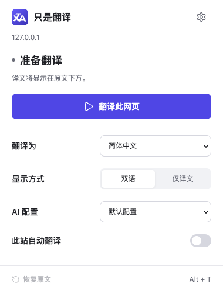
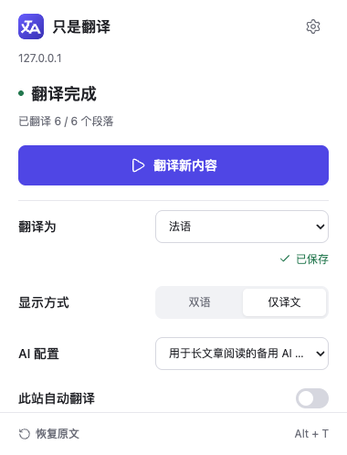
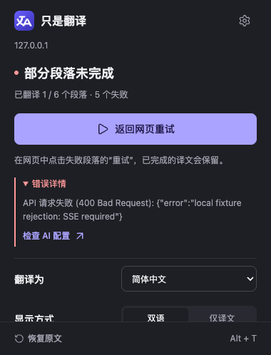
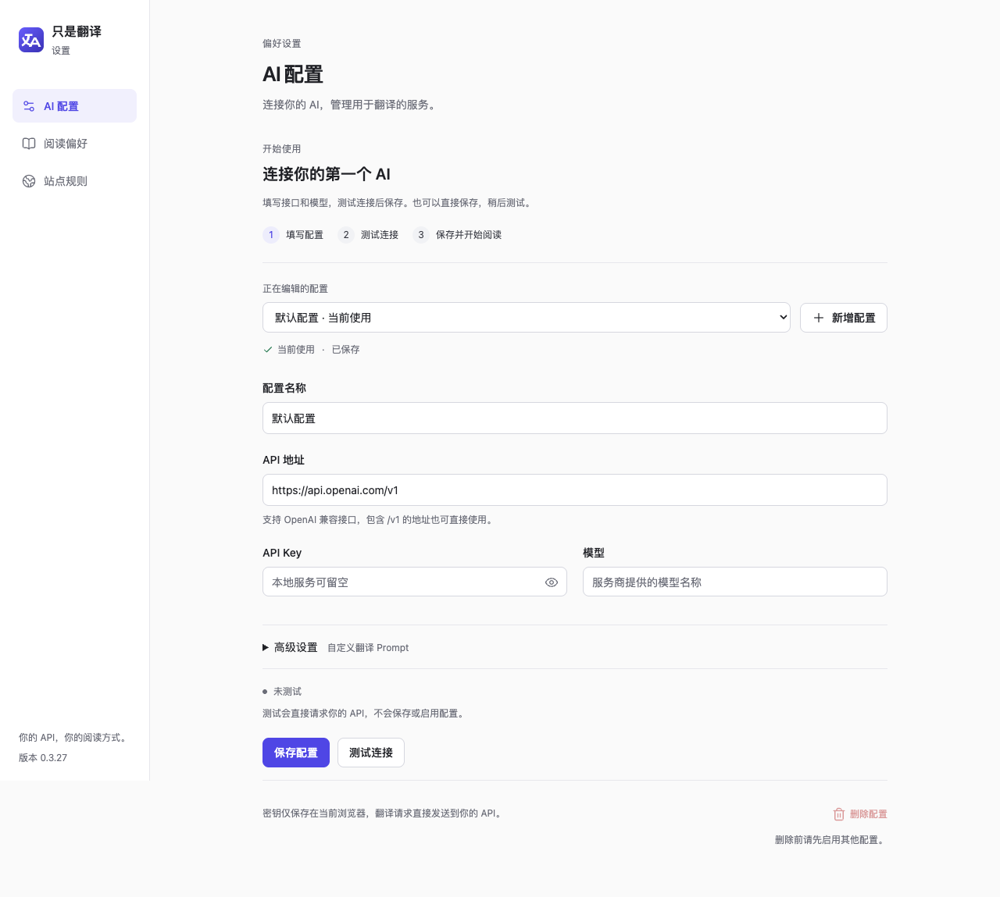

# 「只是翻译」UI / UE 重设计验收

验收日期：2026-09-11。基于本地 `main` 的 `f940d3265f3915c2310324dd56a555db18d1c6e2` 实施，构建产物为项目根目录的 `dist/`。

## 交付范围

- 380px 工具栏弹窗：翻译状态、停止／继续、显式重译、语言、显示方式、AI 配置与本站自动翻译。
- 三栏目设置页：AI 配置与草稿、自动保存的阅读偏好、自动保存的站点规则，以及同页首次配置引导。
- 继承网页排版的译文、轻量加载和可用鼠标／键盘操作的局部失败重试。
- 按用途保存的后台消息、串行存储更新与回读确认、页面实际配置上下文、旧会话响应失效保护。

保留现有存储结构、图标、翻译接口能力和快捷键，未新增依赖或扩展权限。

## 自动化检查

先补充失败用例，再实现行为。最终执行 `pnpm check`：ESLint、34 个测试文件的 **257 项测试**、TypeScript、Vite 构建和构建入口校验全部通过。[完整输出](check.txt)。`git diff --check` 通过。

行为覆盖集中在 `popup-app.test.tsx`、`options-app.test.tsx`、`configuration-service.test.ts`、`controller-context.test.ts`、`auto-start.test.ts` 和现有内容脚本测试：

- 弹窗各状态、设置差异、显式重译、重复操作、保存失败和重试、受限与排除页面。
- AI 编辑与启用分离、按配置保留草稿、连接测试迟到响应、偏好独立保存、并发写入保留其他字段。
- 仅译文失败保留原文、单段重试、恢复 DOM、动态内容不混用语言／配置、取消后迟到响应不修改新状态。
- 精确与通配排除规则优先，直接启动被排除页面也不添加失败节点。

布局验收使用浏览器截图、尺寸与点击位置检查；移除了旧的 CSS 文本匹配式布局测试。

## 真实扩展与模拟 API

使用隔离的 Chromium 152.0.7977.83 配置加载 `dist`，由原生 `chrome.action.openPopup()` 打开工具栏弹窗。设置页和内容脚本运行在真实扩展上下文。请求只访问 `scripts/browser-fixture-server.mjs` 提供的本地模拟 SSE API，使用合成配置与文章。

| 场景                              | 实际结果                                                                                 |
| --------------------------------- | ---------------------------------------------------------------------------------------- |
| 首次配置 → 测试 → 保存 → 弹窗翻译 | 保存回读成功，文章 6 / 6 段完成                                                          |
| 修改目标语言                      | 请求计数保持 5 → 5，保留当前译文并提示显式重新翻译                                       |
| 关闭后重开弹窗                    | 仍显示“用新设置重新翻译”                                                                 |
| 点击重新翻译                      | 新页面上下文使用新语言，6 / 6 段完成                                                     |
| 双语切换为仅译文                  | 6 个原文包装节点隐藏，新增请求数为 0                                                     |
| 恢复原文                          | 译文节点清零，原文章段落恢复                                                             |
| 慢响应时停止／继续                | 2 条在途请求取消，继续后 6 / 6 段完成                                                    |
| 失败后在正文按 Enter 重试         | 1 段成功、5 段保留失败，仅新增 1 个请求                                                  |
| 配置切换与删除                    | 新配置保存后仍需显式启用；删除对话框初始焦点在取消，Escape 关闭                          |
| 自动与不翻译规则冲突              | 最终构建中页面状态 idle，0 个译文／失败节点，0 个 API 请求                               |
| 删除不翻译规则后重新进入          | 自动完成 6 / 6 段，实际配置和语言正确                                                    |
| 深色正文新增动态内容              | 新增段落自动完成；加载反馈继承 `rgb(229, 230, 234)`，背景透明，减少动态效果时动画为 none |

最终构建在全新的隔离浏览器配置中复核了规则冲突、自动翻译、动态内容及连接测试。验收期间修复了扩展设置页携带 `sender.tab` 时保存被误拒绝、320px 窄窗口操作区遮挡模型输入框、排除页面产生失败节点，以及旧预检响应覆盖新会话状态的问题。

## 视觉与尺寸

| 界面           | 实际检查                                                                                |
| -------------- | --------------------------------------------------------------------------------------- |
| 工具栏弹窗     | 内容宽 380px；受测试浏览器可用高度约束时高 498px；底部位于 498px，保持可见              |
| 弹窗正常状态   | 中部 clientHeight / scrollHeight 为 397 / 397，无纵向滚动                               |
| 弹窗长错误     | 中部 clientHeight / scrollHeight 为 397 / 527，仅中部滚动                               |
| 长配置名       | 下拉框省略显示，无元素越过弹窗内容右边界                                                |
| 设置页桌面     | 192px 侧栏、最大 800px 正文；API Key 和模型输入框顶边对齐                               |
| 375px 阅读偏好 | 文档 scrollWidth = innerWidth = 375px                                                   |
| 320px AI 配置  | 文档 scrollWidth = innerWidth = 320px，模型输入框通过实际 elementFromPoint 点击位置检查 |
| 字体           | 扩展正文 computed font-size 为 14px                                                     |

### 弹窗

| 准备翻译                          | 完成与长名称                                  | 深色错误                          |
| --------------------------------- | --------------------------------------------- | --------------------------------- |
|  |  |  |

[设置差异](popup-new-settings-dark.png) · [排除页面](popup-excluded-light.png)

### 设置页

[AI 配置浅色](options-ai-light.png) · [AI 配置深色](options-ai-dark.png) · [连接测试通过](options-connection-passed.png) · [删除确认](options-delete-dialog-dark.png)

[阅读偏好](options-reading-light.png) · [375px 阅读偏好](options-reading-narrow.png) · [站点规则深色](options-sites-dark.png) · [窄窗口站点规则](options-sites-narrow-dark.png) · [320px AI 配置](options-ai-narrow-dark.png)

### 网页正文

[失败与局部重试](article-partial-retry.png) · [仅译文](article-translation-only.png) · [深色加载](article-dark-loading.png) · [深色完成](article-dark-translated.png)

模拟 API 返回带“译文：”前缀的合成结果，只用于验证扩展请求、状态和渲染流程；本次未验收外部服务商的翻译质量。

正文保留既有的原文样式快照机制。深浅色截图使用翻译前已应用的网页主题；网站在翻译完成后改变自身主题时，既有译文颜色不会立即同步，需要恢复原文后重新翻译。扩展弹窗和设置页自身会跟随系统主题变化。
